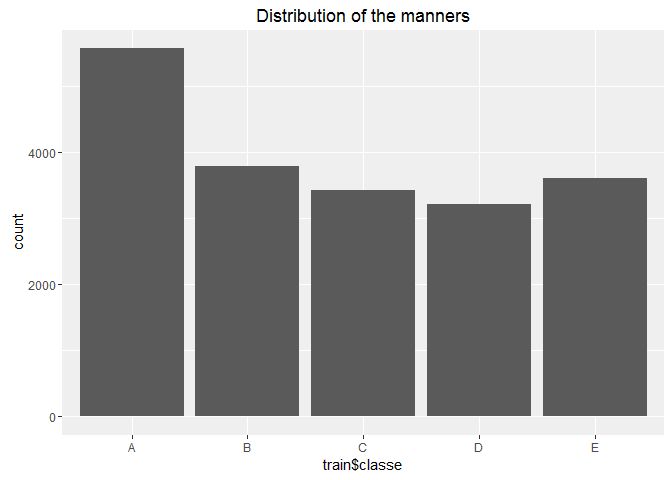

# Human Activity Recognition
Yan Wang  
February 29, 2016  
# Introduction to the project

### Background

Using devices such as Jawbone Up, Nike FuelBand, and Fitbit it is now possible to collect a large amount of data about personal activity relatively inexpensively. These type of devices are part of the quantified self movement – a group of enthusiasts who take measurements about themselves regularly to improve their health, to find patterns in their behavior, or because they are tech geeks. One thing that people regularly do is quantify how much of a particular activity they do, but they rarely quantify how well they do it. In this project, your goal will be to use data from accelerometers on the belt, forearm, arm, and dumbell of 6 participants. They were asked to perform barbell lifts correctly and incorrectly in 5 different ways. More information is available from the website here: http://groupware.les.inf.puc-rio.br/har (see the section on the Weight Lifting Exercise Dataset).

### Goal

The goal of this project is to predict the manner in which they did the exercise. This is the "classe" variable in the training set. You may use any of the other variables to predict with. You should create a report describing how you built your model, how you used cross validation, what you think the expected out of sample error is, and why you made the choices you did. You will also use your prediction model to predict 20 different test cases.

### Data Sources

The training data for this project are available here:

https://d396qusza40orc.cloudfront.net/predmachlearn/pml-training.csv

The test data are available here:

https://d396qusza40orc.cloudfront.net/predmachlearn/pml-testing.csv

The data for this project come from this source: http://groupware.les.inf.puc-rio.br/har. If you use the document you create for this class for any purpose please cite them as they have been very generous in allowing their data to be used for this kind of assignment.


# Model Building Process

### Reproducibility

An overall pseudo-random number generator seed was set at 12345 for all code. In order to reproduce the results below, the same seed should be used.

Different packages were downloaded and installed, such as caret and randomForest. These should also be installed in order to reproduce the results below.


```r
rm(list=ls())
library(caret)
```

```
## Loading required package: lattice
## Loading required package: ggplot2
```

```r
library(corrplot)
library(randomForest)
```

```
## randomForest 4.6-12
## Type rfNews() to see new features/changes/bug fixes.
## 
## Attaching package: 'randomForest'
## 
## The following object is masked from 'package:ggplot2':
## 
##     margin
```

```r
library(kernlab)
```

```
## 
## Attaching package: 'kernlab'
## 
## The following object is masked from 'package:ggplot2':
## 
##     alpha
```

```r
library(nnet)
library(ggplot2)
##library(arm)
set.seed(12345)
```

### Preprocessing

#### Getting Data


```r
trainUrl <- "https://d396qusza40orc.cloudfront.net/predmachlearn/pml-training.csv"
testUrl <- "https://d396qusza40orc.cloudfront.net/predmachlearn/pml-testing.csv"
trainFile <- "./data/pml-training.csv"
testFile  <- "./data/pml-testing.csv"

if (!file.exists("./data")) {
        dir.create("./data")
}
if (!file.exists(trainFile)) {
        download.file(trainUrl, destfile=trainFile)
}
if (!file.exists(testFile)) {
        download.file(testUrl, destfile=testFile)
}

train <- read.csv("./data/pml-training.csv")
test  <- read.csv("./data/pml-testing.csv")
```

#### Cleaning Data

First look at the distribution of the manners in the training dataset.


```r
qplot(train$classe, main = 'Distribution of the manners')
```

 

```r
ggsave('plot1.png')
```

```
## Saving 7 x 5 in image
```

```r
## Cleaning columns with all NA's and turns out no all NA columns in the training data set
indexNA <- sapply(train, function(x)all(is.na(x)))
##table(indexNA)
```

#### Zero- and Near Zero-Variance Predictors

Use nearZeroVar function in caret package to diagnoses predictors that have one unique value (i.e. are zero variance predictors) or predictors that are have both of the following characteristics: they have very few unique values relative to the number of samples and the ratio of the frequency of the most common value to the frequency of the second most common value is large.


```r
nearzero <- nearZeroVar(train, saveMetrics = TRUE)
##table(nearzero$zeroVar)
##table(nearzero$nzv)
## Get rid of columns of nearZeroVar 
train <- train[, !nearzero$nzv]
```

Select variables with high (over 90%) missing data and exclude them from the analysis


```r
indexMissingData <- sapply(colnames(train), function(x) if(sum(is.na(train[, x])) > 0.90*nrow(train)) {return (TRUE)} else {return (FALSE)} )
##table(indexMissingData)
train <- train[, !indexMissingData]
```

Columns 1 to 5 are id, participant names and time, have no contribution to predict the manner so get rid of them


```r
train <- train[,-(1:5)]
```

After cleaning the data the number of predictors is 53.

### Principal Component Analysis

#### Identifying Correlated Predictors

First check if there are predictors with high correlations


```r
correlationMatrix <- cor(train[,-54])
png(height=1200, width=1200, pointsize=25, file="plot2.png")
corrplot::corrplot(correlationMatrix, method = "circle")
dev.off()
```

```
## png 
##   2
```

```r
highCorr <- sum(abs(correlationMatrix[upper.tri(correlationMatrix)]) > 0.9)
```

From the plot we see many of the predictors are highly correlated, and also there are 11 descriptors that are almost perfectly correlated (|correlation| > 0.9)

#### Standardising Variables

If you want to compare different variables that have different units, are very different variances, it would be a better idea to first standardise the variables so that they all have variance 1 and mean 0, and to then carry out the principal component analysis on the standardised data. This would allow us to find the principal components that provide the best low-dimensional representation of the variation in the original data, without being overly biased by those variables that show the most variance in the original data.


```r
preStandardization <- preProcess(train[,-54], method=c("center","scale"))
trainFinal <- predict(preStandardization, train[,-54])
trainFinal <- cbind(trainFinal, classe = train$classe)
```

#### Perform PCA


```r
pca <- prcomp(trainFinal[,-54])
summary(pca)
```

```
## Importance of components:
##                           PC1    PC2     PC3     PC4     PC5     PC6
## Standard deviation     2.8908 2.8562 2.16345 2.03219 1.91129 1.74145
## Proportion of Variance 0.1577 0.1539 0.08831 0.07792 0.06893 0.05722
## Cumulative Proportion  0.1577 0.3116 0.39990 0.47782 0.54675 0.60397
##                            PC7     PC8     PC9    PC10    PC11    PC12
## Standard deviation     1.50047 1.44020 1.31361 1.22839 1.18174 1.07300
## Proportion of Variance 0.04248 0.03914 0.03256 0.02847 0.02635 0.02172
## Cumulative Proportion  0.64645 0.68558 0.71814 0.74661 0.77296 0.79468
##                           PC13    PC14    PC15   PC16    PC17    PC18
## Standard deviation     1.02214 0.97203 0.94121 0.8975 0.85296 0.82308
## Proportion of Variance 0.01971 0.01783 0.01671 0.0152 0.01373 0.01278
## Cumulative Proportion  0.81440 0.83222 0.84894 0.8641 0.87786 0.89064
##                           PC19    PC20    PC21    PC22    PC23    PC24
## Standard deviation     0.77508 0.72728 0.69357 0.64639 0.62435 0.61844
## Proportion of Variance 0.01133 0.00998 0.00908 0.00788 0.00736 0.00722
## Cumulative Proportion  0.90198 0.91196 0.92104 0.92892 0.93627 0.94349
##                           PC25    PC26    PC27    PC28    PC29    PC30
## Standard deviation     0.57813 0.55303 0.53935 0.50533 0.48340 0.45101
## Proportion of Variance 0.00631 0.00577 0.00549 0.00482 0.00441 0.00384
## Cumulative Proportion  0.94980 0.95557 0.96106 0.96587 0.97028 0.97412
##                           PC31    PC32    PC33   PC34    PC35    PC36
## Standard deviation     0.42398 0.41232 0.36213 0.3489 0.33494 0.30314
## Proportion of Variance 0.00339 0.00321 0.00247 0.0023 0.00212 0.00173
## Cumulative Proportion  0.97751 0.98072 0.98319 0.9855 0.98761 0.98934
##                          PC37    PC38    PC39    PC40    PC41    PC42
## Standard deviation     0.2823 0.25289 0.23750 0.23482 0.20198 0.19424
## Proportion of Variance 0.0015 0.00121 0.00106 0.00104 0.00077 0.00071
## Cumulative Proportion  0.9909 0.99205 0.99312 0.99416 0.99493 0.99564
##                           PC43    PC44    PC45    PC46   PC47    PC48
## Standard deviation     0.18786 0.18347 0.17734 0.16917 0.1629 0.14718
## Proportion of Variance 0.00067 0.00064 0.00059 0.00054 0.0005 0.00041
## Cumulative Proportion  0.99631 0.99694 0.99753 0.99807 0.9986 0.99898
##                           PC49    PC50    PC51    PC52    PC53
## Standard deviation     0.14292 0.11593 0.10897 0.07717 0.04636
## Proportion of Variance 0.00039 0.00025 0.00022 0.00011 0.00004
## Cumulative Proportion  0.99937 0.99962 0.99985 0.99996 1.00000
```

This gives us the standard deviation of each component, and the proportion of variance explained by each component. The standard deviation of the components is stored in a named element called “sdev” of the output variable made by “prcomp”


```r
pca$sdev
```

```
##  [1] 2.89076626 2.85618438 2.16344543 2.03218892 1.91128890 1.74145333
##  [7] 1.50046652 1.44020189 1.31361148 1.22838788 1.18173880 1.07300065
## [13] 1.02213533 0.97202623 0.94121227 0.89747085 0.85295940 0.82308254
## [19] 0.77508024 0.72727537 0.69357496 0.64639176 0.62435414 0.61844486
## [25] 0.57813237 0.55303425 0.53935121 0.50533218 0.48339627 0.45101334
## [31] 0.42397946 0.41231820 0.36213363 0.34894913 0.33493634 0.30313580
## [37] 0.28234269 0.25289234 0.23750105 0.23482299 0.20198422 0.19424244
## [43] 0.18786157 0.18347248 0.17734321 0.16916699 0.16294850 0.14717979
## [49] 0.14292160 0.11593195 0.10897099 0.07716847 0.04635653
```

```r
sum((pca$sdev)^2)
```

```
## [1] 53
```

The total variance explained by the components is the sum of the variances of the components


```r
sum((pca$sdev)^2)
```

```
## [1] 53
```

In order to  explain at least 80% of the variance, we would retain the first 13 principal components, as we can see from the output of “summary(pca)” that the first 13 principal components explain 81.44% of the variance.


```r
## Another way to do PCA is to use preProcess function in caret package
prePCA <- preProcess(trainFinal[,-54],method="pca",thresh=.8) #13 components are required
##prePCA$rotation
trainPCA <- predict(prePCA,trainFinal[,-54])
trainPCA <- cbind(trainPCA, classe = trainFinal$classe)
```

### Model Training and Cross Validation

Two classification models are trained: Random forest and a Logistic regression model.


```r
tc <- trainControl(method = "cv", number = 3, verboseIter=FALSE , allowParallel=TRUE)

rf <- train(classe ~ ., data = trainPCA, method = "rf", trControl= tc)
##svmr <- train(classe ~ ., data = trainPCA, method = "svmRadial", trControl= tc)
##NN <- train(classe ~ ., data = trainPCA, method = "nnet", trControl= tc, verbose=FALSE)
##svml <- train(classe ~ ., data = trainPCA, method = "svmLinear", trControl= tc)
##bayesglm <- train(classe ~ ., data = trainPCA, method = "bayesglm", trControl= tc)
logitboost <- train(classe ~ ., data = trainPCA, method = "LogitBoost", trControl= tc)
```

```
## Loading required package: caTools
```

#### Model Selection


```r
print(rf)
```

```
## Random Forest 
## 
## 19622 samples
##    13 predictor
##     5 classes: 'A', 'B', 'C', 'D', 'E' 
## 
## No pre-processing
## Resampling: Cross-Validated (3 fold) 
## Summary of sample sizes: 13081, 13081, 13082 
## Resampling results across tuning parameters:
## 
##   mtry  Accuracy   Kappa      Accuracy SD  Kappa SD   
##    2    0.9645297  0.9551389  0.003929668  0.004955337
##    7    0.9584141  0.9474074  0.004406595  0.005559489
##   13    0.9511262  0.9381894  0.003158420  0.003978690
## 
## Accuracy was used to select the optimal model using  the largest value.
## The final value used for the model was mtry = 2.
```

```r
print(logitboost)
```

```
## Boosted Logistic Regression 
## 
## 19622 samples
##    13 predictor
##     5 classes: 'A', 'B', 'C', 'D', 'E' 
## 
## No pre-processing
## Resampling: Cross-Validated (3 fold) 
## Summary of sample sizes: 13081, 13082, 13081 
## Resampling results across tuning parameters:
## 
##   nIter  Accuracy   Kappa      Accuracy SD  Kappa SD  
##   11     0.5968639  0.4820185  0.01128500   0.01147848
##   21     0.5863428  0.4671198  0.01366561   0.01443903
##   31     0.5866926  0.4739918  0.01203974   0.01724838
## 
## Accuracy was used to select the optimal model using  the largest value.
## The final value used for the model was nIter = 11.
```

For Random Forest model we got model accuracy of 0.9645297, and kappa score of 0.9551389.

For Logistic regression model we got model accuracy of 0.5968639, and kappa score of 0.4820185.

Therefore we choose Random Forest model to predicting test dataset. The expected out-of-sample error will be estimated as 1-accuracy in the cross-validation data which is 0.0354703. We acheived this just by inculding 13 principle components.

# Applying the Model

#### Preprocessing on test data


```r
test <- test[, !nearzero$nzv]
test <- test[, !indexMissingData]
test <- test[,-(1:5)]
testFinal <- predict(preStandardization, test[,-54])
testPCA <- predict(prePCA,testFinal)
```

#### Predicting on the test data using Random Forest Model

```r
testResult <- predict(rf, testPCA)
testResult
```

```
##  [1] B A B A A E D B A A B C B A E E A B B B
## Levels: A B C D E
```

We have the final prediction result of B, A, B, A, A, E, D, B, A, A, B, C, B, A, E, E, A, B, B, B for the 20 test cases.

# Reference

+ http://little-book-of-r-for-multivariate-analysis.readthedocs.org/en/latest/src/multivariateanalysis.html

